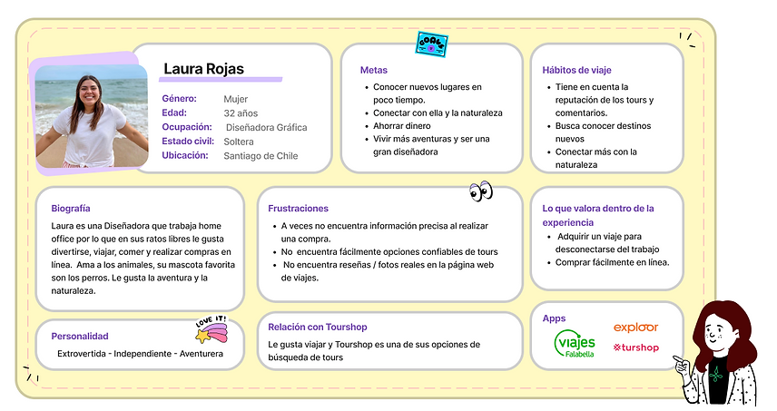

# Proyectos confidenciales

Cuando hablamos de construir un caso de estudio para un portafolio es normal que tengamos algunas dudas de como estructurar o qué información agregar especialmente cuando está involucrada una empresa donde existen algunos factores internos como datos confidenciales o sensibles. Por ello, traemos este apartado para que sirva como guía y te encuentres más preparada ante alguna situación similar.

### Comunicación con negocio sobre temas de confidencialidad 

1. **Definir expectativas desde el principio:** Antes de iniciar cualquier proyecto, conversa sobre la posibilidad de mostrar el trabajo en su portafolio. Es importante aclarar expectativas y restricciones en cuanto a la confidencialidad.
2. **Comunicación efectiva:** Durante el desarrollo del proyecto, mantén una comunicación constante con el negocio/PO. Aclara las expectativas sobre la confidencialidad y ve actualizando sobre tus intenciones de mostrar el trabajo en tu portafolio.
3. **Enfatizar la confidencialidad y el respeto:** Muestra un compromiso firme hacia la confidencialidad y el respeto por la propiedad intelectual de tus clientes. Esto ayudará a construir una relación de confianza y a establecer bases sólidas para futuras colaboraciones.
4. **Ofrecer alternativas:** Si el cliente se muestra renuente a permitir la inclusión del proyecto, considere ofrecer alternativas. Por ejemplo, si no se puede mostrar el proyecto completo, podrías describir el proceso, las metodologías utilizadas o los resultados generales.

### Ejemplos estratégicos para construir el caso de estudio confidenciales 

Te presentamos algunos ejemplos de portafolio de generaciones pasadas que puedes utilizar como referencia para contar el proceso sin necesidad de agregar información específicamente de la empresa:

* Puedes contar sobre la planificación del proyecto, mencionar las herramientas que hiciste y como fueron distribuidas las actividades:

<figure><figcaption></figcaption></figure>

* Agregar la construcción de tu user persona indicando las particularidades que encontraste sobre el usuario, involucrar los detalles relevantes que descubriste enfocados en el proyecto:

<figure><figcaption></figcaption></figure>

* Contar el proceso que fuiste descubriendo de forma general especialmente como fuiste identificando los _pain points_ principales:

<figure><figcaption></figcaption></figure>

* Mostrar la construcción de tu prototipo en media/alta pero reduciendo y/o ocultado información confidencial y especificando el detalle de los cambios realizados en torno a la funcionalidad:

<figure><figcaption></figcaption></figure>

* Mostrar a través de datos los resultados encontrados a nivel de _testing_ en cuanto a tu proyecto:

<figure><figcaption></figcaption></figure>

### Recomendaciones finales 

* Trae a un espacio síncrono los puntos importantes que te gustaría compartir en tu caso de estudio e intenta negociar que si se puede incluir y que propuestas se pueden manejar de otra forma.
* Resaltar la importancia de mantener la ética profesional al presentar proyectos confidenciales en un portafolio y mantén la transparencia en todo momento con cuidado y consideración.
* Recuerda la importancia de respetar la confidencialidad y los acuerdos establecidos por parte de negocio/PO.
* Asegúrate de incorporar las estrategias mencionadas arriba según la situación específica de tu proyecto.
* Ten en cuenta que la confidencialidad de información tiene un periodo definido, entonces puedes revisar y actualizar periódicamente el portafolio a medida que los proyectos confidenciales se vuelvan no confidenciales o se obtenga el permiso para mostrarlos (opcional).

Finalmente no olvides enfatizar en la importancia de la comunicación proactiva y continua con los clientes para garantizar la transparencia, el respeto y la conformidad con los acuerdos de confidencialidad. Esto no solo es esencial para obtener la aprobación del cliente, sino que también fortalece la relación profesional a largo plazo.

