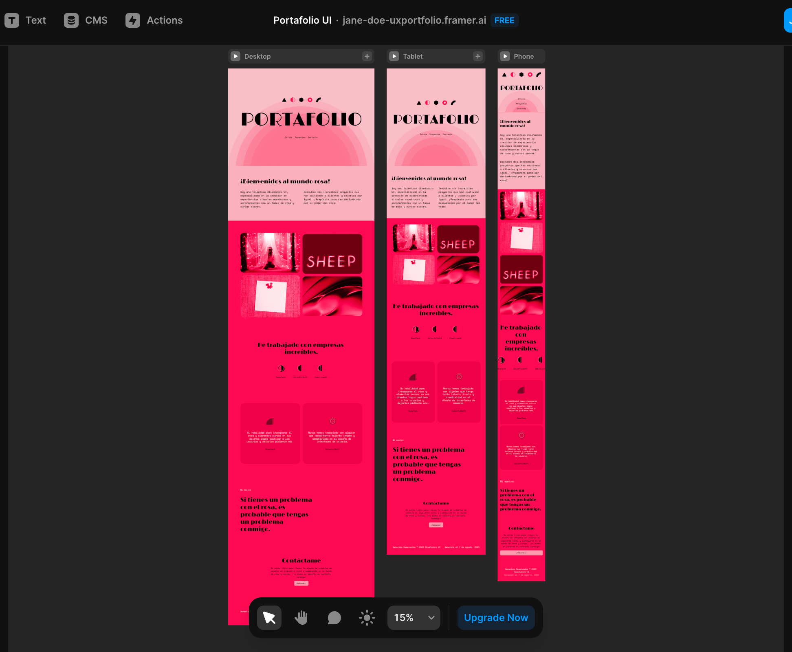

# Recursos complementarios

Solo consume los recursos que creas necesarios, no requieres revisar en detalle todos para terminar tu primera versión. Recuerda que el portafolio en un documento vivo.

### 🧰 Recursos 

* [¿Qué debería incluir y qué no en un portafolio?](http://youtube.com/watch?v=CsUtFuwAtlc) (conversatorio con reclutadoras)
* [Página para Inspirarse con otros trabajos](https://www.awwwards.com/)
* [8 tips para un portafolio UX](https://www.uxdesigninstitute.com/blog/8-ux-portfolio-best-practices/)
* [Sobre colores y la pregunta de ¿se ve muy chichón mi portafolio?](https://www.happyhues.co/palettes/14)
* [Recursos que te permiten ver los colores y sus contrastes](https://colors.eva.design/?utm\_campaign=eva\_colors%20-%20home%20-%20eva\_design%20website\&utm\_source=eva\_design\&utm\_medium=referral\&utm\_content=eva\_website\_menu)

###  Portafolios de estudiantes en generaciones pasadas 

* [Portafolio Karla Angulo](https://www.figma.com/proto/QlropwPFdcyBdkIxunEpDQ/Portafolio-Karla-Angulo---UX-Designer?page-id=412%3A1158\&node-id=412-1298\&viewport=241%2C48%2C0.08\&scaling=contain\&starting-point-node-id=412%3A1160\&hide-ui=1)
* [Portafolio Susana Duran](https://susana-duran-portfolio.webflow.io/)
* [Portafolio Quetzalli Morales](https://quetzidesign.myportfolio.com/quetzidesign)
* [Portafolio Alejandra Acero](https://alejandracero1.wixsite.com/ale-acero-ux)
* [Portafolio Geraline Galvis](https://www.behance.net/galvisgeral)
* [Portafolio Jessica Chávez](https://cjess.notion.site/cjess/Jessica-Ch-vez-7dea7418552048d0bf29b02e303f6b12)
* [Portafolio Adriana Tenorio](https://www.figma.com/proto/8AaZSDxRF8UmvidEudaVB5/Portafolio-AdrianaTenorio?node-id=285-545\&scaling=min-zoom\&page-id=6%3A33\&starting-point-node-id=285%3A545)

###  Inteligencia artificial (IA) para portafolio 

> La [inteligencia artificial](https://www.youtube.com/watch?v=OxSUxvAbFDE) (IA) es una tecnología que se basa en algoritmos y modelos matemáticos que permiten a las máquinas analizar datos, identificar patrones y aprender de la experiencia, lo que les permite realizar tareas complejas de manera autónoma.

**¿Cómo la IA puede ayudarte en la construcción de tu portafolio?**

Aunque la IA no puede escribir tu portafolio 😬, puede ser de gran ayuda, te compartimos [un artículo](https://www.linkedin.com/pulse/chatgpt-cannot-write-ux-portfolios-can-great-advisor-martin-stares/) donde el autor analiza como resolver algunos problemas comunes y los organiza en un pequeño mapa mental.

**Crear el esqueleto del sitio con ayuda de AI**

Con herramientas como [Framer](https://www.framer.com/) o [Durable](https://durable.co/) puedes construir un sitio en cuestión de 30 segundos. A continuación te compartimos un ejemplo de cómo creamos el esqueleto para un sitio que aloje un portafolio.

_Pasos 1 y 2 en Framer:_

<figure><figcaption></figcaption></figure>

 

<figure><figcaption></figcaption></figure>

_Paso 3:_

<figure><figcaption></figcaption></figure>

_Paso 4 (después de 15 segundos de magia):_

<figure><figcaption></figcaption></figure>

La herramienta generó secciones, breakpoints (Versiones desktop, tablet y phone) e incluso un concepto alrededor de la preferencia por el color rosa.

**Optimiza tu portafolio con ayuda de la IA**

Como te compartimos en la sección anterior, aunque la IA no puede escribir tu portafolio, si puede ser de gran ayuda. A continuación te compartimos recursos para:

* [Mejorar el UX writing / Copywriting](https://www.youtube.com/watch?v=RdDkEGDKq0k)
* [Perfeccionar aspectos visuales](https://www.tiktok.com/@lalizlabeth/video/7211212597411024170?is\_from\_webapp=1\&sender\_device=pc)

